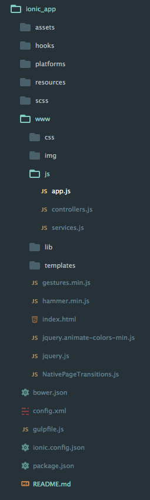

# Ionic实战
这个项目做得比较早，当时是基于ionic1和angular1做的。做了四个tabs的app，首页模仿携程首页，第二页主要是phonegap调用手机核心功能，第三页模仿微信和qq聊天页，第四页模仿一般手机的表单设置页。同时还模仿知乎做了一个侧边栏页。

没有后台，纯前端展示，功能还比较多，调用系统的声音、震动和手机设备信息等。有二维码扫描功能，还做了类似qq消息可拖拽效果，上拉下拉刷新，轮播图组件。

项目的工程目录如下图所示：

platforms是build之后生成的android和ios模拟器文件夹。

resources是app在手机上的图标和开机画面等适配图。

www是前端的工程目录，index.html是入口文件

#### js文件夹

* app.js是app的系统配置和负责tab路由切换；

* controllers.js是主要的逻辑模块

* services.js负责模块间通信的

templates文件夹放置了所有tab的模板，用了很多ionic提供的组件，开发很方便

当时做的ppt下载: [2016.2.3技术分享ionic实战.ppt](./assets/ppt/ionic_app.ppt)

### 使用步骤如下：

0. 克隆仓库到本地

1. 安装node包: npm install

2. 网页版效果: ionic serve

3. 添加平台: ionic cordova platform add android/ios

4. 编译：ionic cordova build android/ios

5. 模拟：ionic cordova emulate android/ios

### 演示如下：

